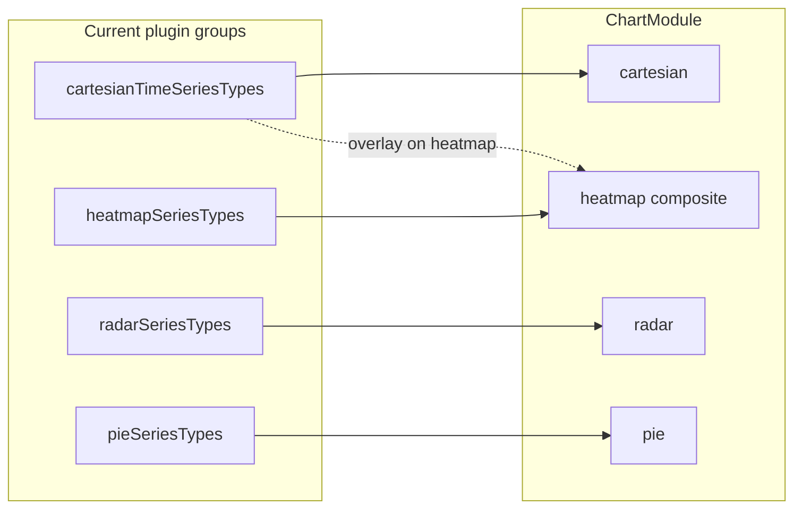
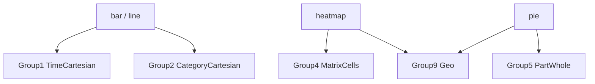
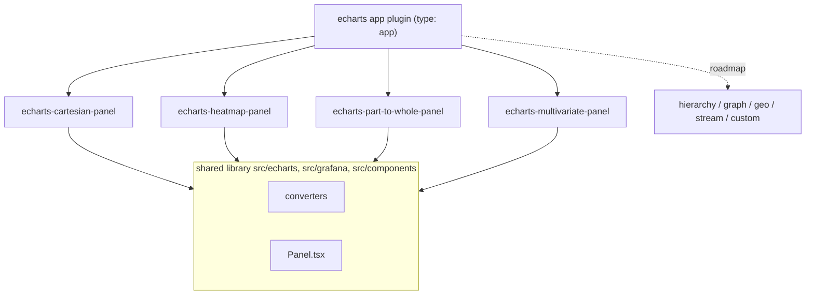

# ECharts Chart Types vs Plugin Panel Categorization Meta Plan

([https://github.com/gtk-grafana/grafana-echarts/issues/7](https://github.com/gtk-grafana/grafana-echarts/issues/7))

## Current WIP structure in code

The plugin uses `**seriesType**` as the panel-level selector (`[src/editor/types.ts](src/editor/types.ts)`, `[src/editor/series.ts](src/editor/series.ts)`) but routes to **four `ChartModule` implementations** via `[resolveChartModule](src/echarts/charts/registry.ts)`:


| Code grouping                            | `SeriesType` values                                  | Data converter                                                                          | Chart module                                              |
| ---------------------------------------- | ---------------------------------------------------- | --------------------------------------------------------------------------------------- | --------------------------------------------------------- |
| `cartesianTimeSeriesTypes`               | line, bar, scatter, effectScatter                    | `[timeSeriesToEChartsOption](src/echarts/converters/timeSeries.ts)` → `[time, value][]` | `[cartesianChartModule](src/echarts/charts/cartesian.ts)` |
| `heatmapSeriesTypes` (+ frame detection) | heatmap, or any type when frame is HeatmapRows/Cells | `[frameToHeatmap](src/echarts/converters/heatmap.ts)` → `HeatmapData` cells             | `[heatmapChartModule](src/echarts/charts/heatmap.ts)`     |
| `radarSeriesTypes`                       | radar                                                | `[frameToCategorical](src/echarts/converters/categorical.ts)` → radar adapter           | `[radarChartModule](src/echarts/charts/radar.ts)`         |
| `pieSeriesTypes`                         | pie                                                  | `frameToCategorical` → pie adapter                                                      | `[pieChartModule](src/echarts/charts/pie.ts)`             |


**7 supported**, **16 disabled** in UI (`[module.ts](src/module.ts)`). Open `@todo`: panel type vs series type (`[src/editor/types.ts:1](src/editor/types.ts)`).

Axis/tooltip routing (`[panelTypeToAxis](src/echarts/axes/converters.ts)`): cartesian + heatmap → `time`; pie/radar → `category`.




---

## Proposed logical panel groups (ECharts + Grafana data)

Grouping is by **shared intermediate data model** and **shared option/axis patterns**, not by ECharts `series.type` alone. A single ECharts type often belongs to multiple groups depending on axis/coordinate mode.

### Group 1 — Time-series Cartesian (implemented)

**Types:** line, bar, scatter, effectScatter

**ECharts:** `coordinateSystem: cartesian2d` (default) or `polar`; x-axis can be `time`, `value`, or `category`.

**Grafana data model:** time field + numeric value fields → `[epochMs, value | null]` per point (`[timeSeries.ts](src/echarts/converters/timeSeries.ts)`).

**Shared options:** dual value axes, stacking, field-level type override (line over bar), Grafana legend, axis crosshair tooltip.

**Matches current code:** `cartesianTimeSeriesTypes` + `cartesianChartModule`.

---

### Group 2 — Category-axis Cartesian (planned, not implemented)

**Types:** line, bar, pictorialBar (same ECharts types as Group 1, different x-axis mode)

**ECharts:** still `cartesian2d`, but x-axis `type: 'category'` with series data as plain y-values (or `[categoryIndex, value]`).

**Grafana data model:** already defined as `[CategoricalData](src/echarts/converters/categorical.ts)` — string categories + numeric series per field. Comment explicitly lists **"category bar/line"** as a future consumer of this model.

**Shared options:** category x-axis, value y-axis, multi-series legend, similar grid/tooltip to Group 1 but **no time crosshair**.

**Gap vs current code:** bar/line are only routed through the time-series converter today. The categorical model exists for pie/radar but is **not wired back** to cartesian rendering.

---

### Group 3 — Multi-value Cartesian (planned, not implemented)

**Types:** candlestick, boxplot

**ECharts:** `cartesian2d` only; each data item carries **multiple dimensions** (OHLC or [min, Q1, median, Q3, max]).

**Grafana data model:** needs a new converter — multiple aligned numeric fields per timestamp (or per category), not the single-value `[time, y]` shape. Comment in `[series.ts:47-48](src/editor/series.ts)` calls this out.

**Candlestick reality (important):** Grafana's own candlestick panel is built *on top of the time series visualization*, so a candlestick frame is **structurally a wide time-series frame** (`TimeSeriesWide`/`TimeSeriesMulti`) — one time field plus numeric fields. There is **no distinct dataplane type**. OHLC semantics are applied by **field-name convention** (`open`, `high`, `low`, `close`, `volume`) with a **manual field-mapping fallback** in the panel editor (Open/High/Low/Close selectors), and any extra fields render as ordinary lines/bars (SMA, Bollinger). See the [candlestick data format](https://grafana.com/docs/grafana/latest/panels-visualizations/visualizations/candlestick/).

**Detection ambiguity:** because the frame is just a wide time series, a candlestick frame is **indistinguishable from a generic multi-field wide time series** at the dataplane level. The MultiValueCartesian converter therefore recognizes OHLC by **field name / in-panel mapping**, not by frame type — and the render type (candlestick vs plain lines) is an in-panel choice. Boxplot `[min, Q1, median, Q3, max]` has **no Grafana-native field convention**; it stays purely ECharts-side (convention defined by this plugin).

**Shared options:** same grid as Group 1, but tooltip/legend semantics differ (OHLC formatter, boxplot outlier handling).

**Gap vs current code:** listed in `SeriesType` union and UI (`[types.ts:12-13](src/editor/types.ts)`, `[series.ts:23-24](src/editor/series.ts)`), but no module or converter.

---

### Group 4 — Matrix / cell density (implemented, composite)

**Types:** heatmap

**ECharts coordinate systems:** cartesian2d (default), **geo**, **calendar**, **matrix** ([ECharts coord-sys table](https://github.com/apache/echarts-doc/blob/master/zh/option/partial/coord-sys.md)).

**Grafana data model:** `[HeatmapData](src/echarts/converters/heatmap.ts)` — cells with explicit bounds `[xStart, xEnd) × [yStart, yEnd)` and scalar value; `xIsTime` flag drives axis type.

**Shared options:** visualMap, bucket y-axis, optional cartesian overlay (Group 1 line/bar/scatter on secondary y-axis) — see `[heatmapChartModule](src/echarts/charts/heatmap.ts)`.

**Matches current code:** `heatmapSeriesTypes` + frame-type auto-detection. Plugin uses a **custom series workaround** because native ECharts heatmap requires category×category axes while Grafana heatmaps need continuous time/numeric x (`[heatmap.ts:10-12](src/echarts/converters/heatmap.ts)`).

**Multi-category span:** heatmap x-axis is **time OR numeric** (`xIsTime`); y-axis is bucket bounds OR ordinal field names. ECharts also supports geo/calendar/matrix — none implemented in plugin.

---

### Group 5 — Categorical part-to-whole (partially implemented)

**Types:** pie, funnel, gauge

**ECharts:** typically **no coordinate system** (self-layout via `center`/`radius`); pie can also embed in geo/cartesian/calendar/matrix.

**Grafana data model:** `CategoricalData` → **one value per category** (pie uses first numeric series only; funnel/gauge would adapt similarly).

**Shared options:** item labels, percent formatters, per-slice color, item-triggered tooltips (no axis pointer).

**Matches current code:** pie only. Funnel and gauge are in the union but disabled.

**Multi-category span:** pie is categorical in **data** but not in **coordinate system** (unlike radar). Gauge is often a **single scalar** — may warrant a sub-variant within this group.

---

### Group 6 — Categorical multi-axis / multivariate (partially implemented)

**Types:** radar, parallel

**ECharts:** dedicated **radar** and **parallel** coordinate systems (not cartesian grid).

**Grafana data model:** radar reuses `CategoricalData` (categories → radar indicators, series → polygons). Parallel expects **one numeric value per dimension per row** — same tabular source but different option shape (parallelAxis array).

**Shared options:** dimension labels, per-series area/line styling, item tooltip (category axis in plugin's `panelTypeToAxis`).

**Matches current code:** radar only. Parallel listed but not implemented.

**Note:** radar and pie share the **same converter** but must stay in **separate chart modules** because coordinate systems and option schemas differ — current split is correct.

---

### Group 7 — Hierarchy (not implemented)

**Types:** tree, treemap, sunburst

**ECharts:** no external coord sys (self-layout); optional calendar/matrix container.

**Grafana data model:** Grafana's real hierarchy-bearing frame is the **flame-graph nested-set model**, *not* a parent-id tree. A single frame carries required fields `level` (number), `value` (number), `self` (number), `label` (string), and **row order is a significant depth-first traversal** — the tree is reconstructed by walking rows and using `level` as the stack depth (no children array or parent pointer). See the [flame graph data format](https://grafana.com/docs/grafana/latest/panels-visualizations/visualizations/flame-graph/). This frame is **out of the dataplane contract** and is signaled by `frame.meta.preferredVisualisationType === 'flamegraph'`, not by `frame.meta.type`.

**Converter:** reconstruct the tree from the `level` ordering, then feed ECharts `treemap`/`sunburst`/`tree` (`value` → node size, `label` → node name), or a `custom` `renderItem` (see Group 11) for a faithful flame-graph layout that also uses `self`.

**Shared options:** drill-down, breadcrumb, levels, item styling by depth.

---

### Group 8 — Graph / flow / relations (not implemented)

**Types:** graph, sankey, chord, lines

**ECharts:** graph creates its own view; sankey/chord self-layout; **lines** uses cartesian/polar/geo/singleAxis depending on context (flow lines, map routes).

**Grafana data model:** the concrete Grafana source is the **node-graph** frame pair (also **out of the dataplane contract**), detected via `frame.meta.preferredVisualisationType === 'nodeGraph'` or frames literally named `nodes` and `edges`. Field-name conventions come from `NodeGraphDataFrameFieldNames` in `[packages/grafana-data/src/utils/nodeGraph.ts](https://github.com/grafana/grafana/blob/main/packages/grafana-data/src/utils/nodeGraph.ts)`:

- **edges frame** — required `id`, `source`, `target`; optional `mainstat`, `secondarystat`, `thickness`, `color`, `strokedasharray`, `detail__`*, `highlighted` (deprecated).
- **nodes frame** (optional; stats can be computed from edges) — required `id`; optional `title`, `subtitle`, `mainstat`, `secondarystat`, `arc__`* (color sections summing to 1), `icon`, `color`, `noderadius`, `detail__*`, `fixedx`/`fixedy`, `highlighted`.

**ECharts mapping:** this maps cleanly onto the ECharts `graph` series — nodes → `series.data` (`id`/`name`, `value` from `mainstat`, `symbolSize` from `noderadius`), edges → `series.links` (`{ source, target }`, `lineStyle` from `thickness`/`color`/`strokedasharray`). `lines`/`sankey`/`chord` reuse the same node/edge source with different layouts.

**Shared options:** edge/link styling, layout algorithms, emphasis on adjacency.

**Multi-category span:** `lines` is the clearest cross-over — same series type can be cartesian flow lines OR geo map routes.

---

### Group 9 — Geo / map (not implemented)

**Types:** map; geo variants of heatmap, scatter, effectScatter, lines, pie

**ECharts:** `geo` coordinate system; map series creates geo exclusively.

**Grafana data model:** region names or lat/lng — not supported by current converters.

---

### Group 10 — Single-axis / stream (not implemented)

**Types:** themeRiver

**ECharts:** `singleAxis` coordinate system.

**Grafana data model:** time-ordered stacked streams — closer to time series but with single axis layout and fixed layer ordering.

---

### Group 11 — Custom escape hatch (not implemented)

**Types:** custom

**ECharts:** user-defined `renderItem` — can emulate any visualization.

**Grafana data model:** undefined; likely out of scope for structured panel types unless exposing raw option editing.

---

## Cross-category spans (critical for panel design)

These ECharts types **cannot be assigned to a single panel group** without also selecting axis/coordinate mode:


| Series type                    | Spans these groups                                                                             | Why                                                            |
| ------------------------------ | ---------------------------------------------------------------------------------------------- | -------------------------------------------------------------- |
| **bar**, **line**              | Group 1 (time x) **and** Group 2 (category x)                                                  | Same `series.type`, different x-axis type and data tuple shape |
| **scatter**, **effectScatter** | Group 1 **and** Group 9 (geo) **and** polar/calendar                                           | `coordinateSystem` switches layout entirely                    |
| **pictorialBar**               | Group 2 **and** polar variant of Group 1                                                       | Same as bar with symbol rendering                              |
| **heatmap**                    | Group 4 (cartesian time/numeric) **and** Group 9 (geo) **and** calendar/matrix                 | Four coordinate systems in ECharts                             |
| **pie**                        | Group 5 **and** embeddable in geo/cartesian                                                    | `coordinateSystemUsage: box` vs standalone                     |
| **lines**                      | Group 8 (flow) **and** Group 1/9 (coordinate lines)                                            | Context-dependent                                              |
| **graph**                      | Group 8 standalone **or** overlaid on cartesian/polar/geo                                      | Dual layout modes in ECharts 6                                 |
| **radar**, **parallel**        | Group 6 only for data, but radar indicators vs parallel dimensions are different option shapes | Shared tabular source, different adapters                      |





---

## Comparison: current WIP vs proposed groups

### What the current model gets right

1. **Separates heatmap** into its own composite module — correct, because `HeatmapData` + visualMap + overlay logic is fundamentally different from simple time series.
2. **Keeps radar and pie as separate modules** while sharing `frameToCategorical` — correct, because coordinate systems differ even when data shape is similar.
3. **Cartesian field overrides** scoped to line/bar/scatter/effectScatter — correct composability boundary.
4. **Frame-type-driven heatmap routing** — sensible Grafana-specific behavior (heatmap frames override panel type).

### Where the current model is incomplete or conflates concepts


| Issue                              | Current behavior                                                                                       | Proposed refinement                                                                                                                                                                                              |
| ---------------------------------- | ------------------------------------------------------------------------------------------------------ | ---------------------------------------------------------------------------------------------------------------------------------------------------------------------------------------------------------------- |
| **"Cartesian" = time-only**        | `cartesianTimeSeriesTypes` assumes time x-axis; `panelTypeToAxis` always returns `time` for this group | Split **TimeCartesian** vs **CategoryCartesian**; axis type should follow data, not series type                                                                                                                  |
| **"Categorical" overloaded**       | Name used for pie/radar data model AND axis tooltip mode (`category`)                                  | Reserve "categorical" for **data model**; use "non-axis" or coord-system names for pie/radar                                                                                                                     |
| **bar/line missing category mode** | Comment in `categorical.ts` promises category bar/line; no routing                                     | Category bar/line should reuse `CategoricalData` → cartesian module with `xAxis.type: category`                                                                                                                  |
| **Multi-value types orphaned**     | candlestick/boxplot in union, no group                                                                 | Add **MultiValueCartesian** group with its own converter                                                                                                                                                         |
| **16 types in flat union**         | Single `seriesType` dropdown mixes unrelated families                                                  | Panel type picker could group by the 11 families above; `seriesType` remains ECharts render type within a family                                                                                                 |
| **Heatmap x-axis nuance lost**     | `panelTypeToAxis('heatmap')` always `time`; code handles numeric x via `xIsTime` at render time        | Axis mapping should be data-driven (`xIsTime`), not type-driven                                                                                                                                                  |
| **panel type vs series type**      | Same `seriesType` field serves both roles                                                              | **Resolved by the app-plugin design:** panel **family** = nested plugin identity; **render type** (line vs bar) = in-panel option; per-field override = within-family (+ composite overlay in the heatmap panel) |


### Suggested routing (app-plugin design)

Rather than growing `[resolveChartModule](src/echarts/charts/registry.ts)` into a large dispatch, each nested panel fixes its own family and advertises fitness via a Visualization Suggestions supplier (see "Routing via Visualization Suggestions"). The old branch conditions become per-panel suggestion scores keyed on the dataplane type:

```
echarts-heatmap-panel       ← HeatmapRows / HeatmapCells present (Best)
echarts-cartesian-panel     ← time + number fields, >1 row (time: Good, category/instant: OK)
echarts-part-to-whole-panel ← Numeric* frames, instant single value (Good)
echarts-multivariate-panel  ← Numeric frames, multiple metrics per entity (OK)
roadmap panels              ← hierarchy / graph / geo / stream / custom (Groups 7–11)
```

Within a panel, the remaining branch logic (time vs category x-axis, single vs multi-value) is chosen from the data (`xIsTime`, field shape), not from a `seriesType` string.

---

## App-plugin restructure (design)

The research above treats the plugin as one panel with a flat `seriesType` picker and runtime routing through `[resolveChartModule](src/echarts/charts/registry.ts)`. The target design converts the repository into a **Grafana app plugin** (`type: app`) that bundles **nested panel plugins**, one per near-term logical family. Per Grafana's [Work with nested plugins](https://grafana.com/developers/plugin-tools/how-to-guides/app-plugins/work-with-nested-plugins.md) guide, each nested plugin is a folder under the app's `src/` with its own `plugin.json` and `module.ts`, but **no per-folder `package.json` or `.config`** — they share the app's single webpack build, which discovers each `plugin.json`.

### Near-term nested panels


| Nested panel                  | Logical groups                          | ECharts render types                                                  | Chart module(s) reused                                                                  |
| ----------------------------- | --------------------------------------- | --------------------------------------------------------------------- | --------------------------------------------------------------------------------------- |
| `echarts-cartesian-panel`     | 1 (time), 2 (category), 3 (multi-value) | line, bar, scatter, effectScatter, pictorialBar, candlestick, boxplot | `[cartesianChartModule](src/echarts/charts/cartesian.ts)` (+ new multi-value converter) |
| `echarts-heatmap-panel`       | 4 (matrix/cells) — **composite**        | heatmap + cartesian overlay                                           | `[heatmapChartModule](src/echarts/charts/heatmap.ts)`                                   |
| `echarts-part-to-whole-panel` | 5                                       | pie, funnel, gauge                                                    | `[pieChartModule](src/echarts/charts/pie.ts)`                                           |
| `echarts-multivariate-panel`  | 6                                       | radar, parallel                                                       | `[radarChartModule](src/echarts/charts/radar.ts)`                                       |


Groups 7-11 (hierarchy, graph/flow, geo, single-axis stream, custom) are **roadmap** nested panels — documented here, not scaffolded.

### Shared library

The existing family-agnostic code becomes a shared library imported by every nested `module.ts`:

- `src/echarts/**` — converters, options, tooltip, axes, layout, style
- `src/grafana/**` — theme adapters
- `src/components/**` — `Panel.tsx`, `Legend.tsx`

Each nested `module.ts` wires the shared `Panel` to its own fixed chart module and family-scoped options. The cross-panel branching in `[resolveChartModule](src/echarts/charts/registry.ts)` collapses: **panel identity fixes the family**, so no runtime type dispatch is needed. Heatmap frame auto-detection moves into per-panel Visualization Suggestions scoring (below).




---

## Routing via Visualization Suggestions

`grafanaDependency` is `>=13.0.0` (`[src/plugin.json](src/plugin.json)`), so each nested panel can opt into the Grafana 13 [Visualization Suggestions](https://grafana.com/developers/plugin-tools/how-to-guides/panel-plugins/add-suggestions-support.md) system with `"suggestions": true` and a `setSuggestionsSupplier`. This replaces the flat `seriesType` dropdown and its `isDisabled` gating in `[src/module.ts](src/module.ts)`:

- **Family** = which nested plugin (chosen by the user or suggested by Grafana).
- **Render type** (line vs bar, pie vs funnel) = an in-panel option/variant within the family.

Each supplier inspects the pre-computed `PanelDataSummary` (`hasDataFrameType`, `hasFieldType`, `isInstant`, `rowCountTotal`) and returns scored variants, so the correct panel surfaces automatically for a given data shape:

- `echarts-cartesian-panel`: `Good` when `TimeSeriesWide`/`TimeSeriesLong` present + time & number fields + >1 row; `OK` otherwise; skip when `isInstant`. A **candlestick-shaped frame scores here like any wide time series** (it is structurally `TimeSeriesWide`); the OHLC render type and field mapping are chosen in-panel, not by a distinct suggestion.
- `echarts-heatmap-panel`: `Best` when `HeatmapRows`/`HeatmapCells` present (this is where the old "heatmap frame forces heatmap" rule lives now).
- `echarts-part-to-whole-panel`: `Good` for `NumericWide`/`NumericMulti`/`NumericLong` (instant, single value per category).
- `echarts-multivariate-panel`: `OK` for numeric frames with multiple metrics per entity.

**Out-of-contract roadmap suppliers (Groups 7-8).** Node-graph and flame-graph carry no dataplane `frame.meta.type`, so `PanelDataSummary.hasDataFrameType` cannot see them. The roadmap graph/hierarchy panels must instead key their suggestions off `frame.meta.preferredVisualisationType` (`'nodeGraph'` / `'flamegraph'`) plus the field-name conventions documented in "Out-of-contract frames" above (e.g. `id`/`source`/`target` for node-graph, `level`/`value`/`self`/`label` for flame-graph). `PanelDataSummary` would need extending to surface `preferredVisualisationType` before these suppliers can score.

---

## Preserving the mixed-visualization override

The current headline feature is the per-field `seriesType` override (`[useCustomConfig` in src/module.ts](src/module.ts), driven by `[cartesianOverrideOptions](src/editor/series.ts)`) that lets one panel mix families — e.g. heatmap cells + line overlay, or bar + line. Splitting per group narrows where mixing can happen. The design keeps it as follows:

- **Within-family mixing stays per panel.** `echarts-cartesian-panel` keeps the per-field override across cartesian render types, so a field can draw as `bar` while others stay `line` (both live on the shared time/value grid).
- **Cross-family mixing survives only inside composite panels.** `echarts-heatmap-panel` keeps `[frameHasCartesianOverride](src/editor/series.ts)`: a numeric frame whose field is overridden to a cartesian type is drawn as a cartesian **overlay** on the heatmap cells (heatmap + line), because that one panel owns both layers.
- **No cross-panel mixing.** Two separate panels cannot overlay each other, so cross-family combinations must be modeled as a composite panel that owns every layer it draws. The heatmap panel is the sanctioned place for heatmap+line; the cartesian panel for bar+line.

---

## Grafana dataplane correlation

Correlating each logical group with the [Grafana dataplane contract](https://grafana.com/developers/dataplane/) frame kinds and their formats:

- **Time series** — `TimeSeriesWide`, `TimeSeriesMulti`, `TimeSeriesLong`
- **Numeric** — `NumericWide`, `NumericMulti`, `NumericLong` (instant: one value per metric)
- **Heatmap** — `HeatmapRows`, `HeatmapCells`
- **Logs** — `LogLines`


| Logical group           | Dataplane kind | Subtypes / formats        | Notes                                                                                                                                                                                                                                                                |
| ----------------------- | -------------- | ------------------------- | -------------------------------------------------------------------------------------------------------------------------------------------------------------------------------------------------------------------------------------------------------------------- |
| 1 Time cartesian        | Time series    | Wide, Multi, Long         | Maps to `[time, value]` in `[timeSeries.ts](src/echarts/converters/timeSeries.ts)`; Long carries dimensions in string fields                                                                                                                                         |
| 2 Category cartesian    | Numeric        | Wide, Multi, Long         | Instant/single value per series; a string field becomes the category axis (matches `[CategoricalData](src/echarts/converters/categorical.ts)`)                                                                                                                       |
| 3 Multi-value cartesian | Time series    | Wide, Multi               | Structurally `TimeSeriesWide`/`Multi` — no distinct subtype. OHLC is a **field-name/manual-mapping convention** (open/high/low/close/volume), not a structural gap; boxplot is plugin convention. Indistinguishable from generic wide time series at the frame level |
| 4 Heatmap               | Heatmap        | HeatmapRows, HeatmapCells | `TimeSeriesWide` is directly consumable as heatmap-rows (each value field → a row); matches `xIsTime` + `HeatmapData` in `[heatmap.ts](src/echarts/converters/heatmap.ts)`                                                                                           |
| 5 Part-to-whole         | Numeric        | Wide, Multi, Long         | One value per category (pie uses first numeric field)                                                                                                                                                                                                                |
| 6 Multivariate          | Numeric        | Long, Wide                | Multiple metrics per entity/row → radar indicators / parallel axes                                                                                                                                                                                                   |
| 7 Hierarchy             | *(none)*†      | —                         | Grafana flame-graph **nested-set** frame (`level`/`value`/`self`/`label`, depth-first order); **out of contract**, signaled by `preferredVisualisationType: 'flamegraph'`                                                                                            |
| 8 Graph / flow          | *(none)*†      | —                         | Grafana node-graph frame pair (nodes + edges, `id`/`source`/`target`); **out of contract**, signaled by `preferredVisualisationType: 'nodeGraph'` or frames named nodes/edges                                                                                        |
| 9 Geo                   | *(none)*       | —                         | lat/lng or geohash fields (Geomap convention); **out of contract**                                                                                                                                                                                                   |
| — Logs                  | Logs           | LogLines                  | No direct ECharts group; only after aggregation into log-volume bars (feeds Group 1/4). **Unmapped**                                                                                                                                                                 |


† **Detected via a different channel.** Node-graph and flame-graph are *not* dataplane kinds and carry no `frame.meta.type`. They are signaled by `frame.meta.preferredVisualisationType` (enum in `[grafana-data/src/types/data.ts](https://github.com/grafana/grafana/blob/main/packages/grafana-data/src/types/data.ts)`: `graph | table | logs | trace | nodeGraph | flamegraph | rawPrometheus`), which is a **separate routing signal** from the dataplane `frame.meta.type`. Any suggestion/detection logic for Groups 7-8 must inspect this field (and the field-name conventions), not `PanelDataSummary.hasDataFrameType`.

---

## Out-of-contract frames (node-graph, flame-graph)

The [Grafana dataplane contract](https://grafana.com/developers/dataplane/) defines only Time series, Numeric, Heatmap, Histogram, and Logs kinds. Two visualizations that map onto ECharts Groups 7-8 fall **outside** that contract and are instead identified by `frame.meta.preferredVisualisationType` (see footnote above):

### Node-graph → Group 8 (`preferredVisualisationType: 'nodeGraph'`, or frames named `nodes`/`edges`)

Field-name conventions from `NodeGraphDataFrameFieldNames` (`[grafana-data/src/utils/nodeGraph.ts](https://github.com/grafana/grafana/blob/main/packages/grafana-data/src/utils/nodeGraph.ts)`):

- **edges** (required): `id`, `source`, `target`. Optional: `mainstat`, `secondarystat`, `thickness`, `color`, `strokedasharray`, `detail__`*, `highlighted` (deprecated → use `color`).
- **nodes** (optional frame; stats otherwise computed from edges): `id` (required). Optional: `title`, `subtitle`, `mainstat`, `secondarystat`, `arc__`* (color sections summing to 1), `icon`, `color`, `noderadius`, `detail__*`, `fixedx`/`fixedy`, `highlighted`.

**ECharts target:** `graph` series — nodes → `series.data`, edges → `series.links` (`{ source, target }`). `sankey`/`chord`/`lines` reuse the same node/edge source with different layouts.

### Flame-graph → Group 7 (`preferredVisualisationType: 'flamegraph'`)

Single frame in a **nested set model** (depth-first row order is significant):

- Required: `level` (number, nesting depth), `value` (number, cumulative width), `self` (number, value minus children), `label` (string).
- Tree is reconstructed by walking rows and treating `level` as stack depth — no children array or parent pointer.

**ECharts target:** reconstruct the tree, then `treemap`/`sunburst`/`tree` (`value` → size, `label` → name), or a `custom` `renderItem` (Group 11) for a faithful flame-graph that also uses `self`.

Both are emitted by profiling/tracing sources (e.g. Pyroscope flame graphs; Tempo / X-Ray service graphs) rather than by the metrics/logs data sources that produce dataplane frames.

---

## Example data sources per logical group

Popular data sources that already emit frames in each grouping:

- **Group 1 (time series):** Prometheus (range query), Loki (metric query), InfluxDB, Graphite, SQL sources with "Format as: Time series".
- **Group 2 (numeric / category):** Prometheus (instant query), Postgres/MySQL `GROUP BY` (NumericLong), Elasticsearch terms aggregation, CloudWatch.
- **Group 3 (multi-value):** financial OHLC via Infinity or JSON API, SQL OHLC tables.
- **Group 4 (heatmap):** Prometheus histograms (`le` buckets → HeatmapRows), Elasticsearch histogram aggregation, Loki log-volume.
- **Group 5 (part-to-whole):** Prometheus (instant vector), SQL aggregates, CloudWatch metrics.
- **Group 6 (multivariate):** SQL multi-column aggregates, multiple Prometheus instant metrics, Infinity JSON.
- **Groups 7-9 (roadmap):** Tempo / AWS X-Ray service graph (graph/nodes), SQL parent-id trees (hierarchy), Elasticsearch `geo_point` / PostGIS (geo).

---

## ECharts complete type inventory (23 registered series types)

All types are already listed in `[SeriesType](src/editor/types.ts)`. Mapping to proposed groups:


| ECharts type  | Proposed group(s)   | Supported today |
| ------------- | ------------------- | --------------- |
| line          | 1, 2                | 1 only          |
| bar           | 1, 2                | 1 only          |
| scatter       | 1, 9                | 1 only          |
| effectScatter | 1, 9                | yes             |
| pictorialBar  | 2 (+ polar)         | no              |
| candlestick   | 3                   | no              |
| boxplot       | 3                   | no              |
| heatmap       | 4, 9                | yes             |
| pie           | 5, 9                | yes             |
| funnel        | 5                   | no              |
| gauge         | 5                   | no              |
| radar         | 6                   | yes             |
| parallel      | 6                   | no              |
| tree          | 7                   | no              |
| treemap       | 7                   | no              |
| sunburst      | 7                   | no              |
| graph         | 8 (+ overlay modes) | no              |
| sankey        | 8                   | no              |
| chord         | 8                   | no              |
| lines         | 8, 1, 9             | no              |
| map           | 9                   | no              |
| themeRiver    | 10                  | no              |
| custom        | 11                  | no              |


---

## Key takeaway for panel-type design

The plugin's WIP categorization is really **two orthogonal axes**:

1. **Data shaping** (time series / categorical tabular / matrix cells / graph-hierarchy / geo)
2. **Coordinate layout** (cartesian grid / radar / parallel / none / geo / custom)

Current code collapses (1) and (2) into `seriesType` + four modules. That works for the **Grafana time-series-first** MVP but breaks down when:

- The same ECharts type (bar, line, heatmap, pie) needs different data converters depending on whether the x-dimension is time, category, or numeric.
- Types like `lines` or `graph` need context beyond a single dropdown value.

The `[CategoricalData](src/echarts/converters/categorical.ts)` intermediate model is the right abstraction for Groups 2, 5, and 6 — but today it only feeds pie and radar, not category-axis cartesian charts that the comments already anticipate.

The **app-plugin design** resolves these two axes cleanly: data shaping stays in the shared converter library (keyed off dataplane frame types), while coordinate layout is owned by each nested panel plugin. The flat `seriesType` dropdown is replaced by nested-plugin identity + Visualization Suggestions, the per-field override is preserved within a family (and cross-family only inside the composite heatmap panel), and the `@todo figure out panel type vs series type` is settled: panel **family** = plugin, **render type** = in-panel option.

No code changes are made in this pass — this remains a research/design document. The frontmatter todos capture the actionable follow-up: scaffold the `type: app` shell, extract the shared library, add per-panel suggestion suppliers, and preserve the mixing rules.

### Note

For each to-do, create a plan from this meta plan and review it carefully before proceeding. Force prompter review after each step within the sub-plan, do not **ever** implement more then one step at a time.